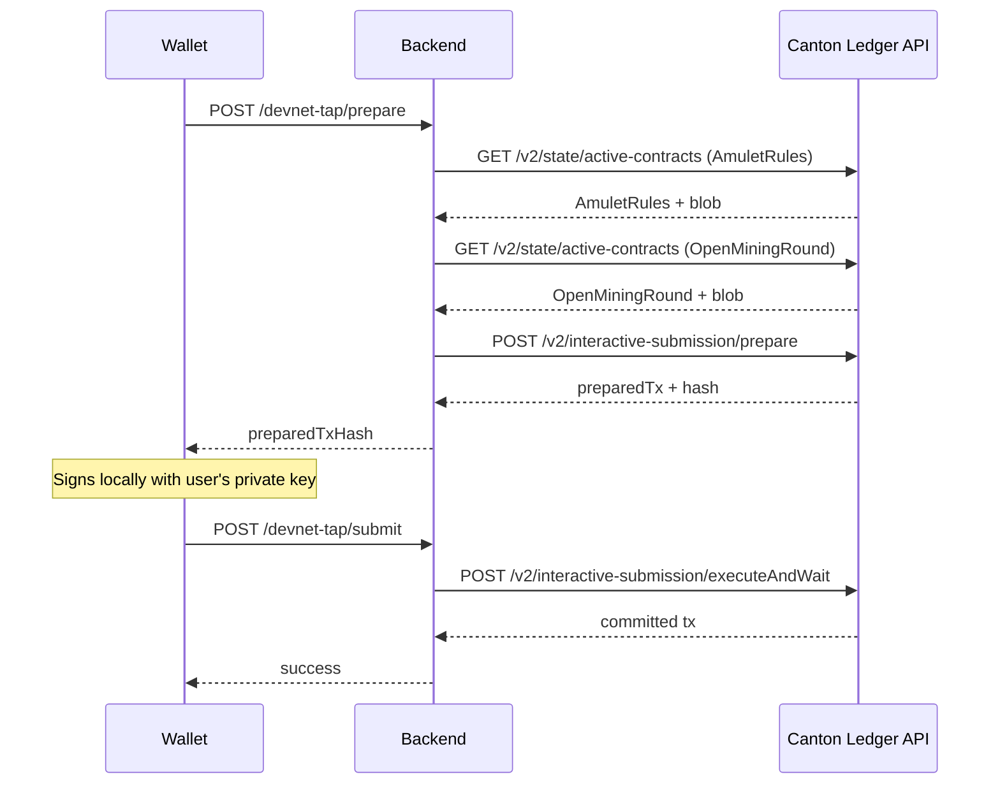
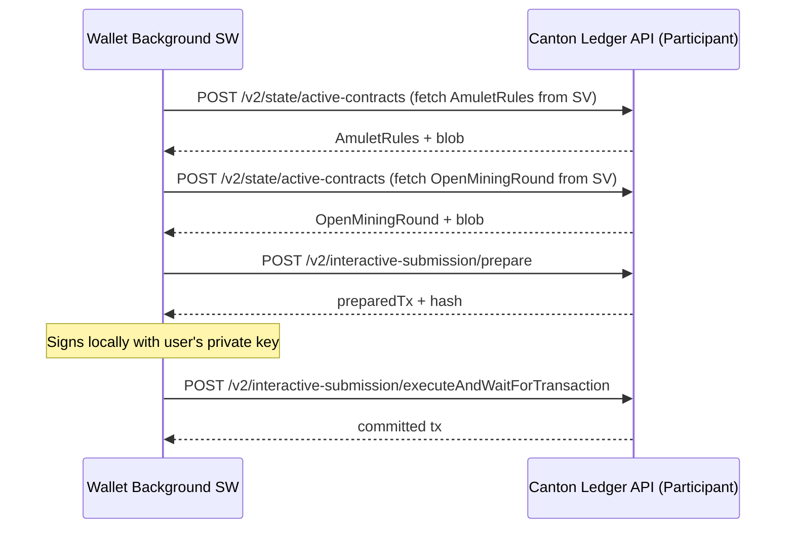

# Backlog: DevNet Amulet Faucet on Token Detail Screen

**Status:** Backlog
**Priority:** Medium
**Scope:** Ginkgo extension + dapp-core

## Overview

Add a "Request Amulet" faucet button to the Token Detail screen, visible only when the user is on **Devnet** and viewing the **Amulet (CC)** token. The faucet uses the Daml `AmuletRules_DevNet_Tap` choice, which mints new CC directly — no admin wallet or existing balance required. The user signs the transaction with their own key.

> **Note:** `AmuletRules_DevNet_Tap` only exists in DevNet mode. It is not available on Testnet or Mainnet.

## Existing Infrastructure (already built)

- `MSG.REQUEST_FAUCET` message action — defined in `lib/messaging/constants.ts`
- `handleRequestFaucet()` handler — exists in `entrypoints/background/handlers/api.handler.ts` (currently calls the old backend endpoint)
- Message routing — wired in `entrypoints/background.ts`
- `useNetwork()` hook — available to check `network === 'devnet'`
- Token Detail screen — `entrypoints/popup/pages/dashboard/TokenDetail.tsx`
- Network config — `lib/network.ts` with `NetworkId` type

---

## Approach A: Backend-Proxied DevNet Tap (Recommended)

The backend creates new prepare/submit endpoints that internally call the Canton Ledger JSON API to exercise `AmuletRules_DevNet_Tap`. The wallet follows the existing prepare → sign → submit pattern.

### Architecture



### Backend Changes

**File: `external-party.controller.ts`**

- Add `POST /external-party/devnet-tap/prepare` endpoint
- Add `POST /external-party/devnet-tap/submit` endpoint
- Guard: only allow on devnet (check environment or add `@IsDevnet()` guard)

**File: `topology.service.ts`**

- Add `prepareDevNetTap(partyId: string, amount: number)` method:
  1. Fetch `AmuletRules` contract from ledger via `/v2/state/active-contracts` with `includeCreatedEventBlob: true`
  2. Fetch latest `OpenMiningRound` contract similarly
  3. Build ExerciseCommand for `AmuletRules_DevNet_Tap`:

     ```json
     {
       "ExerciseCommand": {
         "templateId": "#splice-amulet:Splice.AmuletRules:AmuletRules",
         "contractId": "<amuletRulesCid>",
         "choice": "AmuletRules_DevNet_Tap",
         "choiceArgument": {
           "receiver": "<walletPartyId>",
           "amount": "<amount>.0",
           "openRound": "<openMiningRoundCid>"
         }
       }
     }
     ```

  4. Call `prepareInteractiveSubmission()` with the command + disclosed contracts (AmuletRules blob + OpenMiningRound blob)
  5. Return `{ preparedTransactionHash, preparedTransaction, hashingSchemeVersion }`
- Add `submitDevNetTap(params)` method that calls `executeInteractiveSubmission()`

**New DTOs:**

- `PrepareDevNetTapDto`: `{ partyId: string, amount?: number }` (default amount: 100 CC)
- `PrepareDevNetTapResponseDto`: `{ preparedTransactionHash, preparedTransaction, hashingSchemeVersion }`
- `SubmitDevNetTapDto`: `{ preparedTransaction, hashingSchemeVersion, signature, partyId }`

### Wallet Changes

**File: `entrypoints/background/handlers/api.handler.ts`**

- Update `handleRequestFaucet()` to become a two-step flow:
  - `handlePrepareDevNetTap()` → calls `POST /external-party/devnet-tap/prepare`
  - Keep existing `MSG.REQUEST_FAUCET` or split into `PREPARE_DEVNET_TAP` + `SUBMIT_DEVNET_TAP`

**File: `entrypoints/background/handlers/signing.handler.ts`**

- Add `handleSignAndSubmitDevNetTap()` following existing transfer pattern

**File: `entrypoints/popup/hooks/useFaucet.ts`** (new)

- `usePrepareDevNetTap()` mutation
- `useSignAndSubmitDevNetTap()` mutation (invalidates balance cache on success)

**File: `entrypoints/popup/pages/dashboard/TokenDetail.tsx`**

- Add conditional faucet button:

  ```tsx
  {tokenId === 'Amulet' && network === 'devnet' && (
    <Button onClick={handleFaucet}>Request Amulet (DevNet)</Button>
  )}
  ```

- Password confirmation dialog (same pattern as transfers)
- Success/error toast notifications

### Pros

- Follows existing architecture exactly (prepare → sign → submit)
- No new auth infrastructure needed — backend already has Canton API access
- Server-side secrets stay on the server
- Minimal wallet changes

### Cons

- Requires backend deployment for faucet to work
- Backend must be running and reachable

### Estimated effort

- Backend: ~2-3 hours (new endpoint pair + service method)
- Wallet: ~2 hours (hook + UI + message wiring)

---

## Approach B: Direct Canton Ledger API from Wallet

The wallet's background service worker calls the Canton Ledger JSON API directly, bypassing the backend entirely.

### Architecture (Direct)



### Auth Requirements (the blocker)

The Canton JSON API requires authentication on every request:

| Environment | Auth mechanism | Credentials needed |
|-------------|---------------|-------------------|
| Local/Quickstart | HS256 JWT signed with shared secret | `auth.jwtSecret` (server-side secret) |
| Devnet/Testnet/Mainnet | Auth0 / Keycloak client credentials | `client_id` + `client_secret` (server-side secrets) |

The JWT `sub` must identify a Canton user with `CanActAs` rights for the wallet's party.

**These are server-side secrets that cannot be embedded in a Chrome extension** — anyone can inspect extension source code and extract them.

### Possible workaround: Backend-issued Canton JWT relay

The backend could expose an endpoint like `GET /canton/token` that:

1. Authenticates the wallet user via the existing backend JWT
2. Issues a short-lived, scoped Canton JWT for that user's party
3. Returns the token + Canton API URLs to the wallet

The wallet would then use this token for direct Canton API calls.

### Additional config needed in wallet

```typescript
// lib/network.ts — would need to add:
export const NETWORKS = {
  devnet: {
    // ... existing fields ...
    participantLedgerApi: 'https://???',  // Canton JSON API URL
    svLedgerApi: 'https://???',           // SV participant URL (for disclosed contracts)
    synchronizerId: '???',                // Or discovered at runtime
  },
};
```

- Canton participant JSON API URL per network
- SV participant JSON API URL per network (for fetching AmuletRules/OpenMiningRound)
- DSO party ID resolution (currently via validator scan-proxy)
- Synchronizer ID (currently via `/v2/state/connected-synchronizers`)

### Wallet Changes (Direct)

**File: `lib/network.ts`**

- Add `participantLedgerApi`, `svLedgerApi` to `NetworkConfig`

**File: `entrypoints/background/canton-client.ts`** (new)

- Direct HTTP client for Canton JSON API
- JWT management (obtain from backend relay endpoint or configure)
- Methods: `fetchActiveContracts()`, `prepareInteractiveSubmission()`, `executeInteractiveSubmission()`

**File: `entrypoints/background/handlers/faucet.handler.ts`** (new)

- Full DevNet Tap logic:
  1. Obtain Canton JWT (from backend relay or cached)
  2. Fetch AmuletRules + OpenMiningRound from SV
  3. Build ExerciseCommand
  4. Call prepare
  5. Sign with user's private key
  6. Call execute

**File: `entrypoints/popup/pages/dashboard/TokenDetail.tsx`**

- Same UI as Approach A

### Pros (Direct)

- True self-custody: wallet talks to Canton directly, no backend dependency for faucet
- Could be extended for other direct ledger operations in the future
- Faucet works even if backend is down (if JWT relay is pre-cached)

### Cons (Direct)

- **Auth is a fundamental blocker** — requires either embedding secrets (insecure) or a backend JWT relay endpoint (which negates the "no backend" advantage)
- Significant new infrastructure in the wallet (Canton API client, auth management, URL config)
- Must handle Canton API errors, retries, and token refresh in the extension
- SV JSON API URL may not be publicly accessible on all networks
- ~4x more implementation effort than Approach A

### Estimated Effort (Direct)

- Backend (JWT relay endpoint): ~1-2 hours
- Wallet (Canton client + handler + UI): ~6-8 hours

---

## Approach C: Backend Config Endpoint (Future Improvement)

Instead of hardcoding Canton API URLs in the wallet's `lib/network.ts`, the backend could expose a single endpoint that returns both the Canton JWT **and** the Canton API URLs:

### Endpoint

```text
GET /auth/canton-config
Authorization: Bearer <backend-jwt>

Response:
{
  "cantonToken": "<Canton JWT>",
  "validatorToken": "<Validator JWT>",
  "userId": "<Canton admin user>",
  "ledgerUrl": "<Participant Ledger API URL>",
  "validatorUrl": "<Validator API URL>",
  "faucetEnabled": true
}
```

### Benefits

- **No hardcoded infrastructure URLs** — the wallet only needs the backend API URL per network
- **Single source of truth** — Canton API URLs are configured only in the backend's `.env`
- **Easier multi-environment support** — adding a new environment doesn't require a wallet code change
- **Dynamic faucet availability** — backend can enable/disable faucet based on runtime config

### Implementation

1. Backend: new method on `CantonClientService` that returns URLs from its config
2. Backend: new endpoint `GET /auth/canton-config` protected by `JwtAuthGuard`
3. Wallet: fetch config on demand (or cache it), remove hardcoded `cantonLedgerUrl`/`cantonValidatorUrl` from `NetworkConfig`

### When to implement

When the number of environments grows beyond 4, or when Canton API URLs change frequently across deployments. Currently, hardcoded URLs in `lib/network.ts` are simpler and work for localnet + devnet.

---

## Current Implementation Status

**Implemented:** dapp-core SDK middleware approach (prepare/sign/submit)

- dapp-core backend uses `@canton-network/wallet-sdk` internally for Canton Ledger API interactions
- Extension calls `POST /external-party/devnet-tap/prepare` → signs locally → `POST /external-party/devnet-tap/submit`
- UI: faucet section on Amulet Token Detail when `config.faucetEnabled` is true (Localnet + Devnet)
- Handler: `api.handler.ts` → `handleRequestFaucet()` (3-step: prepare, sign with cached key, submit)

## References

- Quickstart faucet script: `Quickstart/quickstart/docker/utxo-handling/03-request-faucet-amulet.sh`
- Daml choice: `AmuletRules_DevNet_Tap` on `#splice-amulet:Splice.AmuletRules:AmuletRules`
- Required disclosed contracts: `AmuletRules` + `OpenMiningRound` (from SV participant)
- dapp-core faucet endpoints: `Quickstart/dapp-core/src/modules/external-party/` (prepare + submit)
- dapp-core SDK integration: `@canton-network/wallet-sdk` used server-side for Canton Ledger API
