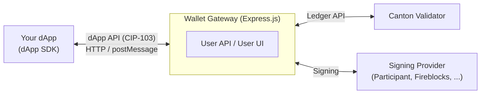
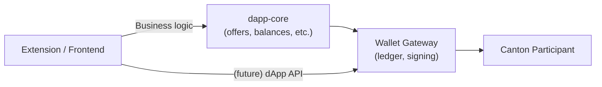
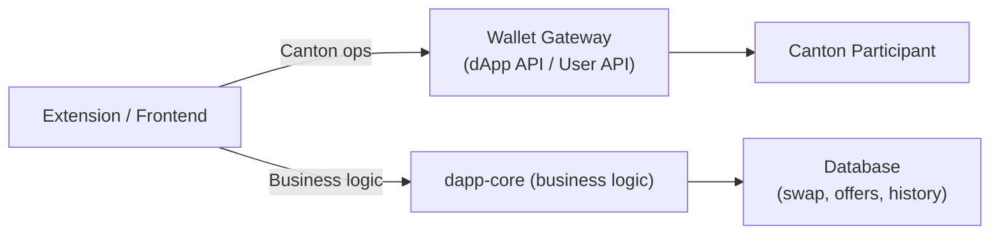

# Backlog: Adopt Splice Wallet Kernel / Wallet Gateway

**Status:** Backlog
**Priority:** Low (future improvement)
**Scope:** dapp-core + Ginkgo Extension

## Context

The `@canton-network/wallet-sdk` npm package is **Node.js only** (confirmed by its README: "Currently the SDK only supports NodeJS environments"). Attempting to bundle it in the browser extension requires stubbing `http2`, `dns`, `fs`, `tls`, `net`, and polyfilling `crypto`, `buffer`, etc. — and the gRPC transport still won't function at runtime.

The upstream source repo is **Splice Wallet Kernel** (`hyperledger-labs/splice-wallet-kernel`), a TypeScript monorepo by Digital Asset that provides the official framework for building wallet integrations on Canton Network.

Local clone: `/Users/lehoanganh/Working/FETCH/Angelhack/Canton/splice-wallet-kernel/`

## Splice Wallet Kernel Overview

### Architecture



### Key Packages

| Package | Purpose |
|---------|---------|
| `wallet-gateway/remote` | Express.js HTTP server — the Wallet Gateway |
| `wallet-gateway/extension` | Browser extension gateway — **NOT IMPLEMENTED YET** |
| `sdk/wallet-sdk` | Low-level SDK for backends (Node.js only) |
| `sdk/dapp-sdk` | Browser SDK for dApps (CIP-103 client) |
| `core/signing-lib` | Signing driver interfaces |
| `core/signing-internal` | Internal Ed25519 signing (same as our extension) |
| `core/signing-participant` | Canton participant-managed signing |
| `core/signing-fireblocks` | Fireblocks integration |
| `core/signing-blockdaemon` | Blockdaemon integration |
| `core/ledger-client` | TypeScript Canton Ledger API client (OpenAPI-generated) |
| `core/wallet-store-sql` | SQLite / PostgreSQL persistence (Kysely ORM) |
| `core/wallet-auth` | JWT + OAuth authentication middleware |
| `core/token-standard` | Canton Token Standard implementation |

### Capabilities

- Multi-network support via JSON config (local, devnet, testnet, mainnet in one deployment)
- Pluggable signing providers (Participant, Internal Ed25519, Fireblocks, Blockdaemon)
- Full interactive submission lifecycle (prepare → sign → execute)
- Party allocation with external keypairs
- DevNet tap/faucet via `TokenStandardController.createTap()`
- dApp API (CIP-103) — JSON-RPC 2.0 standard for dApp ↔ wallet communication
- SQLite or PostgreSQL persistence
- Health checks (`/healthz`, `/readyz`)

### Configuration

Single JSON config file — example for localnet:

```json
{
  "kernel": { "id": "my-gateway", "clientType": "remote" },
  "server": { "port": 3030 },
  "store": { "connection": { "type": "sqlite", "database": "store.sqlite" } },
  "signingStore": { "connection": { "type": "sqlite", "database": "signingStore.sqlite" } },
  "bootstrap": {
    "idps": [{
      "id": "idp-self-signed",
      "type": "self_signed",
      "issuer": "self-signed"
    }],
    "networks": [{
      "id": "canton:localnet",
      "name": "LocalNet",
      "identityProviderId": "idp-self-signed",
      "auth": {
        "method": "self_signed",
        "clientId": "ledger-api-user",
        "clientSecret": "unsafe",
        "audience": "https://canton.network.global",
        "scope": "openid daml_ledger_api offline_access"
      },
      "ledgerApi": { "baseUrl": "http://localhost:2975" }
    }]
  }
}
```

---

## Overlap with Our Backend

| Capability | dapp-core | Wallet Gateway |
|---|---|---|
| Canton Ledger API | `@canton-network/wallet-sdk` (SDK-wrapped) | `LedgerClient` (OpenAPI-generated) |
| Interactive submission | SDK `LedgerController.prepareSignAndExecuteTransaction()` | Built-in prepare → sign → execute |
| Party allocation | Custom onboarding flow | `PartyAllocationService` |
| Auth to Canton | SDK-managed via Gateway proxy (`gatewayService.ledgerApiPost`) | Pluggable (self-signed, OAuth, client_credentials) |
| Signing | External only (wallet extension signs) | Pluggable drivers (4 providers) |
| Multi-network | Single network per `.env` deployment | Multi-network in one config, runtime switching |

## What dapp-core Has That the Gateway Doesn't

- Offer management (incoming/outgoing transfer requests, approve/reject)
- Transaction history (paginated activity feed)
- User management (Google OAuth sign-up, profiles)
- Token balances (aggregated with locked/unlocked breakdown via `listHoldingUtxos`)
- Transfer preapproval registration
- Faucet (DevNet tap via SDK)
- Business-specific DTOs and API contracts

---

## Adaptation Paths

### Path A: Deploy Gateway as Sidecar

Deploy the Wallet Gateway alongside dapp-core. dapp-core delegates all Canton ledger interactions to the Gateway's User API.

**Architecture:**



**Changes:**

- Replace dapp-core's SDK-based Canton calls with HTTP calls to Gateway's User API
- Configure Gateway with same network/auth as dapp-core's `.env`
- Run both services (dapp-core + Gateway)

**Pros:**

- Clean separation of concerns
- Get all Gateway features (multi-network, pluggable signing) for free
- Future-proof: can expose dApp API (CIP-103) for third-party dApps

**Cons:**

- Two services to deploy and maintain
- Extra network hop for Canton operations
- Need to sync auth state between the two services

### Path B: Embed wallet-sdk in dapp-core — CURRENT APPROACH

Use `@canton-network/wallet-sdk` as a library inside dapp-core. Replace hand-rolled Canton code with SDK controllers.

**Status:** Implemented. dapp-core already uses wallet-sdk for all Canton Ledger API interactions (balances via `listHoldingUtxos`, transfers, offers, faucet via `createTap`).

**Pros:**

- Minimal architectural change — swap out the Canton layer, keep everything above it
- Single service deployment
- wallet-sdk is designed for exactly this use case
- No polyfill/stub issues (Node.js native)

**Cons:**

- Still maintaining our own auth, signing flow, and network config
- Don't get Gateway's pluggable signing drivers or multi-network config
- Must track wallet-sdk version updates manually

### Path C: Replace Backend with Gateway + Business Logic Layer

Use the Wallet Gateway as the primary Canton backend. Keep dapp-core as a pure business logic service on top.

**Architecture:**



**Changes:**

- Extension uses `@canton-network/dapp-sdk` for standard Canton operations
- dapp-core becomes a pure business logic service (no Canton calls)
- Wallet Gateway handles auth, signing, network management

**Pros:**

- Most "correct" architecture long-term
- Clean separation: Canton plumbing vs. business logic
- Get CIP-103 dApp API standard for free
- Pluggable signing drivers (Fireblocks, Blockdaemon for institutional wallets)
- Multi-network runtime switching

**Cons:**

- Significant restructuring
- Two services + database migration
- Extension needs to talk to two backends (already the case — extension talks to both dapp-core and Wallet Gateway)

---

## Recommendation

**Current:** Using **Path B** — dapp-core embeds wallet-sdk for all Canton interactions (balances, transfers, offers, faucet). This is live and working.

**Medium-term:** Evaluate **Path A** — run the Wallet Gateway as a sidecar when we need multi-network support or pluggable signing beyond Ed25519.

**Long-term:** Consider **Path C** to eliminate Canton calls from dapp-core entirely. The extension already talks to the Wallet Gateway for CIP-0103 dApp API operations and onboarding — extending this to cover all wallet operations would simplify the architecture.

## Key Files in splice-wallet-kernel

| File | Purpose |
|------|---------|
| `wallet-gateway/remote/src/init.ts` | Gateway server initialization with all signing drivers |
| `wallet-gateway/remote/src/config/Config.ts` | Zod configuration schema |
| `wallet-gateway/remote/src/user-api/controller.ts` | User API: createWallet, sign, execute, sessions |
| `wallet-gateway/remote/src/dapp-api/controller.ts` | dApp API: connect, prepareExecute, ledgerApi proxy |
| `wallet-gateway/test/config.json` | Full example config with local, devnet, localnet networks |
| `sdk/wallet-sdk/src/tokenStandardController.ts` | Token transfers + `createTap()` (faucet) |
| `sdk/wallet-sdk/src/ledgerController.ts` | Core ledger operations (prepare/sign/execute) |
| `sdk/wallet-sdk/src/topologyController.ts` | External party allocation |
| `core/signing-internal/` | Internal Ed25519 signing driver |
| `core/ledger-client/` | TypeScript Canton Ledger API client |
| `docs/dapp-building/wallet-gateway/configuration/` | Detailed configuration documentation |

## References

- Repo: `https://github.com/hyperledger-labs/splice-wallet-kernel`
- CIP-103 spec: `https://github.com/canton-foundation/cips/blob/main/cip-0103/cip-0103.md`
- wallet-sdk README: `splice-wallet-kernel/sdk/wallet-sdk/README.md`
- Gateway config docs: `splice-wallet-kernel/docs/dapp-building/wallet-gateway/configuration/index.md`
