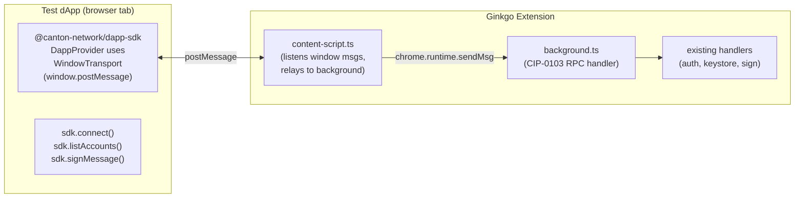
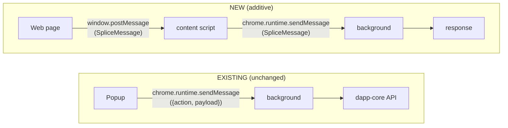
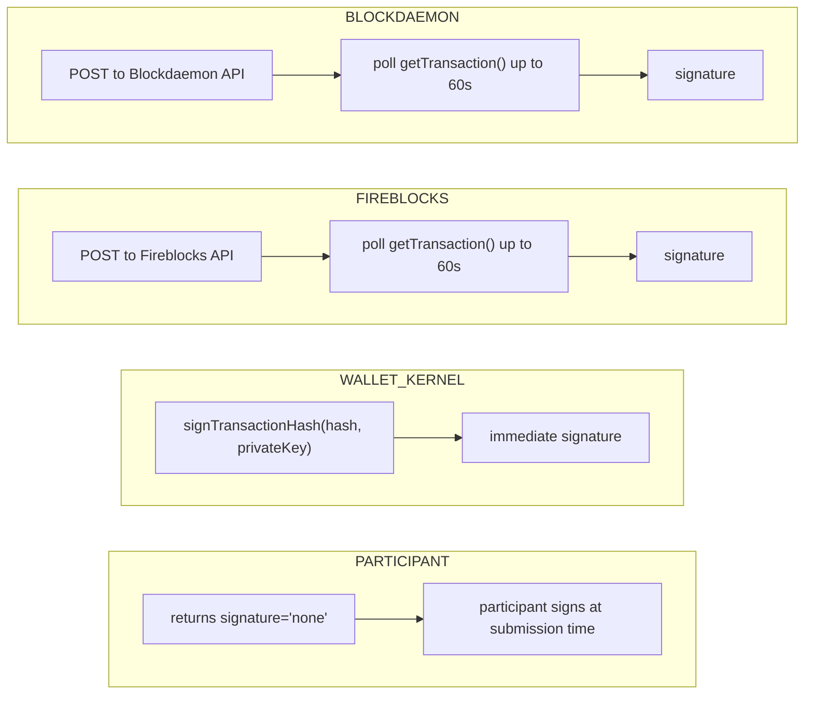
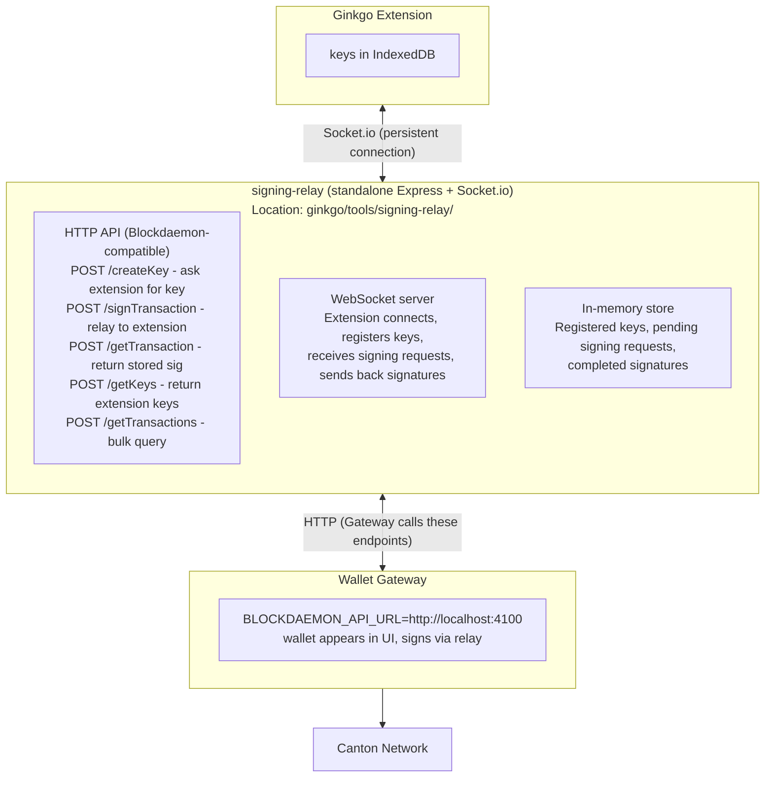

# dApp Connectivity via CIP-0103 (Splice Wallet Kernel)

## Context

This document explores using [splice-wallet-kernel](https://github.com/hyperledger-labs/splice-wallet-kernel)'s dApp SDK and CIP-0103 protocol to enable web dApps to connect to the Ginkgo browser extension for wallet connection, account discovery, and transaction signing — similar to how MetaMask works for Ethereum dApps.

**Goal**: Build a proof-of-concept that validates the architecture before integrating into canton-exchange-frontend.

---

## What splice-wallet-kernel Provides

### `@canton-network/dapp-sdk` — Frontend SDK for dApps

- EIP-1193-compatible provider (`window.canton`) — same pattern as Ethereum's `window.ethereum`
- CIP-0103 standard: vendor-neutral JSON-RPC 2.0 dApp API
- **Two transport modes**:
  - `postMessage` (for browser extension wallets) via `DappProvider` + `WindowTransport`
  - HTTP/SSE (for remote wallet gateway servers) via `DappAsyncProvider`
- High-level API: `connect()`, `disconnect()`, `listAccounts()`, `getPrimaryAccount()`, `signMessage()`, `prepareExecute()`, `ledgerApi()`
- Real-time events: `onStatusChanged`, `onAccountsChanged`, `onTxChanged`
- Source: `splice-wallet-kernel/sdk/dapp-sdk/`

### `wallet-gateway/extension/` — Reference Extension Gateway

- **Content script** (`content-script.ts`) that relays `postMessage` from web pages to extension background via `chrome.runtime.sendMessage`
- **Background script** (`background.ts`) that handles JSON-RPC requests, dispatches to a controller
- **dApp API controller** (`dapp-api/controller.ts`) — implements the CIP-0103 methods
- **Status**: Partially implemented — `connect`, `disconnect`, `listAccounts` work; `prepareExecute`, `status`, `signMessage`, `getPrimaryAccount` throw "not implemented"
- Source: `splice-wallet-kernel/wallet-gateway/extension/`

### `@canton-network/core-splice-provider` — Provider Infrastructure

- `injectProvider()` function that sets `window.canton` on the page
- `DappProvider` class using `WindowTransport` for `postMessage` communication
- Global type declaration: `Window.canton?: DappProviderInterface`
- Source: `splice-wallet-kernel/core/splice-provider/src/`

### Example dApps

- **Ping** (`examples/ping/`) — Minimal React+Vite dApp demonstrating connect, accounts, ledger queries, transaction submission
- **Portfolio** (`examples/portfolio/`) — More complete dApp with holdings, transactions, transfers

---

## Current State of Ginkgo

Ginkgo has **full CIP-0103 dApp connectivity** (all phases implemented):

- Content script (`entrypoints/content.ts`) bridges dApp `window.postMessage` ↔ extension `chrome.runtime.sendMessage`
- Provider marker script (`entrypoints/provider.content.ts`) injects `window.canton` for SDK detection
- All 11 CIP-0103 methods implemented in `dapp-api.handler.ts` (connect, disconnect, isConnected, status, getActiveNetwork, listAccounts, getPrimaryAccount, signMessage, signTransaction, prepareExecute/prepareExecuteAndWait, ledgerApi)
- Gateway-mediated methods (prepareExecute, ledgerApi) route through Wallet Gateway JSON-RPC
- MetaMask-style approval popups for connect, signMessage, signTransaction, prepareExecute
- Event broadcasting (statusChanged, accountsChanged) via chrome.storage.onChanged
- Private keys isolated in background service worker
- Signing relay bridges Gateway signing requests to extension-held keys

---

## Architecture: How dApp ↔ Extension Communication Works



### Discovery Flow (how dApp finds the extension)

1. dApp SDK sends `SPLICE_WALLET_EXT_READY` via `window.postMessage`
2. Extension content script responds with `SPLICE_WALLET_EXT_ACK`
3. dApp SDK knows extension is present → creates `DappProvider` with `WindowTransport`
4. All subsequent calls: `postMessage` → content script → `chrome.runtime.sendMessage` → background → response back

### Reference: splice-wallet-kernel Content Script

From `splice-wallet-kernel/wallet-gateway/extension/src/content-script.ts`:

```typescript
import { SpliceMessage, SpliceMessageEvent, WalletEvent } from '@canton-network/core-types'
import Browser from 'webextension-polyfill'

window.addEventListener('message', async (event: SpliceMessageEvent) => {
    const { data: msg, success } = SpliceMessage.safeParse(event.data)
    if (!success) return

    // Forward JSON RPC requests to the background script
    if (msg.type === WalletEvent.SPLICE_WALLET_REQUEST) {
        const msgResponse = await Browser.runtime.sendMessage(msg)
        const response = SpliceMessage.parse(msgResponse)
        window.postMessage(response, '*')
    }

    // Forward UI open requests to the background script
    if (msg.type === WalletEvent.SPLICE_WALLET_EXT_OPEN) {
        await Browser.runtime.sendMessage(msg)
    }

    // Acknowledge the extension readiness request
    if (msg.type === WalletEvent.SPLICE_WALLET_EXT_READY) {
        window.postMessage({ type: WalletEvent.SPLICE_WALLET_EXT_ACK }, '*')
    }
})
```

### Reference: splice-wallet-kernel Background Handler

From `splice-wallet-kernel/wallet-gateway/extension/src/background.ts`:

```typescript
import Browser from 'webextension-polyfill'
import { dappController } from './dapp-api/controller'
import { isSpliceMessage, SpliceMessage, WalletEvent } from '@canton-network/core-types'
import { rpcErrors } from '@canton-network/core-rpc-errors'

const controller = dappController()

function jsonRpcResponse(id, payload) {
    return {
        response: { jsonrpc: '2.0', id, ...payload },
        type: WalletEvent.SPLICE_WALLET_RESPONSE,
    }
}

Browser.runtime.onMessage.addListener((message, _, sendResponse) => {
    if (isSpliceMessage(message)) {
        if (message.type === WalletEvent.SPLICE_WALLET_REQUEST) {
            // Route JSON-RPC method to controller
            const method = message.request.method
            controller[method](message.request.params)
                .then((result) => sendResponse(jsonRpcResponse(id, { result })))
                .catch((error) => sendResponse(jsonRpcResponse(id, { error: rpcErrors.internal({ message: error.message }) })))
        } else if (message.type === WalletEvent.SPLICE_WALLET_EXT_OPEN) {
            Browser.windows.create({ url: message.url, type: 'popup', width: 400, height: 600 })
        }
    }
    return true // async response
})
```

---

## Prototype Plan

### Part 1: Ginkgo Extension Changes

**Goal**: Add CIP-0103 content script + background handler so the extension responds to dApp SDK calls.

#### Step 1: Add content script entry point

Create `entrypoints/content.ts` (WXT content script):

- Mirror the logic from splice-wallet-kernel's `content-script.ts` (see reference above)
- Listen for `window.postMessage` events matching `SpliceMessage` format
- Relay `SPLICE_WALLET_REQUEST` messages to background via `chrome.runtime.sendMessage`
- Forward responses back to the page via `window.postMessage`
- Respond to `SPLICE_WALLET_EXT_READY` with `SPLICE_WALLET_EXT_ACK` (extension discovery)
- Respond to `SPLICE_WALLET_EXT_OPEN` by forwarding to background (open wallet UI popup)

#### Step 2: Add CIP-0103 background handler

Add dApp API handler alongside existing message handlers in `entrypoints/background.ts`:

- Detect `SpliceMessage` format (different from current internal `chrome.runtime` messages)
- Route to a new dApp API controller
- Return JSON-RPC 2.0 formatted responses
- **Keep existing popup ↔ background messaging untouched**

#### Step 3: Implement dApp API controller

Create `entrypoints/background/handlers/dapp-api.handler.ts`:

| Method | Implementation | Notes |
|---|---|---|
| `connect` | Return `{ isConnected: true }` if wallet is unlocked and has a party | Check existing auth state |
| `disconnect` | No-op or clear dApp session | Simple for prototype |
| `status` | Return connection + session info | Read from existing auth/lock state |
| `listAccounts` | Return `[{ partyId, primary: true }]` from stored party | Map existing party data to CIP-0103 format |
| `getPrimaryAccount` | Return the active party as a wallet/account object | Same as above, single account |
| `signMessage` | Decrypt key → sign with `signTransactionHash()` → return signature | Reuse existing signing handler logic; may need approval popup |

#### Step 4: Install splice-wallet-kernel dependencies

Add to `package.json`:

- `@canton-network/core-types` — for `SpliceMessage`, `WalletEvent` types and parsing
- `@canton-network/core-rpc-errors` — for standardized JSON-RPC error responses

**OR** copy the minimal type definitions inline if dependency issues arise (the types are small).

#### Step 5: Update WXT config for content script

WXT auto-discovers entrypoints from `entrypoints/`. Adding `content.ts` should auto-register it. May need to configure `matches` for which URLs the content script runs on (e.g., `["<all_urls>"]` or specific localhost/domain patterns).

#### Files to create/modify

| File | Action | Description |
|---|---|---|
| `entrypoints/content.ts` | **NEW** | Content script — relay postMessage ↔ background |
| `entrypoints/background.ts` | **MODIFY** | Add SpliceMessage listener alongside existing handler |
| `entrypoints/background/handlers/dapp-api.handler.ts` | **NEW** | CIP-0103 dApp API controller |
| `wxt.config.ts` | **MODIFY** | Content script match patterns (if needed) |
| `package.json` | **MODIFY** | Add splice-wallet-kernel type dependencies |

---

### Part 2: Minimal Test dApp

**Goal**: A simple React + Vite app that uses `@canton-network/dapp-sdk` to connect to the wallet extension.

#### Structure

```text
canton-test-dapp/
├── package.json
├── vite.config.ts
├── tsconfig.json
├── index.html
└── src/
    ├── main.tsx
    ├── App.tsx          # Main component with connect/disconnect
    └── App.css
```

#### Features

1. **Connect button** — calls `sdk.connect()`, displays connection status
2. **Account display** — calls `sdk.listAccounts()`, shows party ID
3. **Sign message** — calls `sdk.signMessage("test")`, displays signature
4. **Disconnect button** — calls `sdk.disconnect()`
5. **Extension detection** — shows whether `window.canton` / extension is detected

#### Example dApp Code

```typescript
import * as sdk from '@canton-network/dapp-sdk'

// Check if extension is present
const result = await sdk.isConnected()
console.log('Connected:', result.isConnected)

// Connect (triggers extension interaction)
await sdk.connect()

// Get accounts
const accounts = await sdk.listAccounts()
const primary = accounts.find((a) => a.primary)
console.log('Party ID:', primary?.partyId)

// Sign a message
const signature = await sdk.signMessage('Hello, Canton!')
console.log('Signature:', signature)

// Listen for events
sdk.onStatusChanged((status) => console.log('Status:', status))
sdk.onAccountsChanged((accounts) => console.log('Accounts:', accounts))
```

#### dApp SDK Availability

The `@canton-network/dapp-sdk` may not be published to npm. Options:

- **Option A**: Build from source in splice-wallet-kernel and `yarn link`
- **Option B**: Copy the built SDK output
- **Option C**: If published to npm/GitHub packages, install directly

---

## Backward Compatibility with dapp-core Backend

**Adding CIP-0103 support will NOT break existing wallet functionality.**

### Current Backend Communication

Ginkgo talks to **dapp-core** (Quickstart/dapp-core) — not canton-exchange-backend — via Axios:

| Network | Backend URL |
|---|---|
| localnet | `http://localhost:3003/` |
| devnet | `https://api-devnet.kairo.ag/` |
| testnet | `https://api-testnet.kairo.ag/` |
| mainnet | `https://api.kairo.ag/` |

API endpoints called: `/auth/*`, `/wallet/*`, `/transfer-token-standard/*`, `/external-party/*`, `/transfer-preapproval/*`

### Why CIP-0103 Changes Are Safe

**1. Message format isolation**: Existing popup messages use `{ action: 'GOOGLE_AUTH', payload: {...} }`. CIP-0103 messages use `{ type: 'SPLICE_WALLET_REQUEST', request: { jsonrpc: '2.0', method, params } }`. These are structurally different — the existing router's switch statement on `message.action` will never match a SpliceMessage.

**2. Content script is purely additive**: Adding `entrypoints/content.ts` creates a new WXT entry point. It doesn't modify the popup or background entry points. The content script only bridges `window.postMessage` (web page) ↔ `chrome.runtime.sendMessage` (background).

**3. Two independent communication channels**:



**4. Background handler coexistence**: The `chrome.runtime.onMessage` API supports multiple listeners. The new CIP-0103 listener checks `isSpliceMessage(message)` first — if the message isn't a SpliceMessage, it returns early and the existing handler processes it normally.

**5. No backend API changes**: The CIP-0103 handler reuses existing internal functions (auth state checks, signing logic). It doesn't add new backend endpoints or change how the wallet calls dapp-core.

### Implementation Strategy

```typescript
// In background.ts — add BEFORE the existing listener:
chrome.runtime.onMessage.addListener((message, _sender, sendResponse) => {
  // CIP-0103 messages from content script
  if (isSpliceMessage(message)) {
    handleDappApiRequest(message).then(sendResponse).catch(/* ... */);
    return true;
  }
  // Not a SpliceMessage — fall through to existing handler
});

// Existing handler remains completely unchanged:
chrome.runtime.onMessage.addListener((message: MessageRequest, _sender, sendResponse) => {
  const handler = routeMessage(message);
  handler.then(sendResponse).catch((e) => sendResponse(err(String(e))));
  return true;
});
```

---

## Dependencies & Risks

| Risk | Mitigation |
|---|---|
| `@canton-network/dapp-sdk` not on npm | Build from splice-wallet-kernel source, use `yarn link` |
| `@canton-network/core-types` version mismatch | Pin to same version used in splice-wallet-kernel |
| Content script injection blocked by CSP | Test on localhost first; configure `matches` in manifest |
| SpliceMessage format may differ from internal message format | Keep handlers separate — existing popup handler untouched |
| WXT content script auto-discovery | Verify WXT picks up `entrypoints/content.ts` correctly |

---

## Verification

1. **Build Ginkgo** with the new content script: `yarn build`
2. **Load extension** in Chrome (unpacked from build output)
3. **Start test dApp**: `npm run dev` (localhost)
4. **Open test dApp in browser**, open DevTools console
5. **Verify extension detection**: Console should show `SPLICE_WALLET_EXT_ACK` response
6. **Click Connect**: Should return connection status from extension
7. **Click List Accounts**: Should return party ID from extension's stored account
8. **Click Sign Message**: Should return a valid signature (may require wallet to be unlocked)

---

## Future: Path to canton-exchange-frontend Integration

Once the prototype validates the architecture:

### What Would Change

The dApp SDK operates at a different abstraction level than the current canton-exchange-frontend:

| Current Flow | dApp SDK Flow |
|---|---|
| Frontend manages keys in IndexedDB | **Wallet extension** manages keys |
| Frontend signs transactions directly | **Wallet extension** signs on behalf of dApp |
| Frontend calls backend prepare/submit APIs | dApp calls `sdk.prepareExecute(commands)` → wallet handles it |
| Auth via backend JWT | Auth via `sdk.connect()` → wallet session |
| Party ID stored in localStorage | Party ID from `sdk.getPrimaryAccount()` |

### Integration Steps

1. Add `@canton-network/dapp-sdk` to canton-exchange-frontend
2. Create a `useWalletConnection` hook wrapping `sdk.connect/disconnect/listAccounts`
3. For transaction signing: backend `prepare` → get hash → `sdk.signMessage(hash)` → backend `submit`
4. Gradually replace direct IndexedDB key management with wallet-delegated signing
5. Add "Connect Wallet" button alongside existing auth flow (progressive enhancement)

### Files That Would Change

| File | Current | After SDK Integration |
|---|---|---|
| `src/api/apiClient.ts` | Axios + JWT auth interceptor | Keep for non-wallet APIs, add `sdk.ledgerApi()` for ledger calls |
| `src/stores/auth.ts` | Jotai atoms from localStorage | Replace with `sdk.isConnected()` + `sdk.getPrimaryAccount()` |
| `src/hooks/useIndexedDB.ts` | Read encrypted keys | **Remove** — keys managed by extension |
| `src/pages/dashboard/swap/SignTransaction.tsx` | Decrypt key → sign → submit | `sdk.prepareExecute(swapCommands)` |
| `src/pages/dashboard/transfer/index.tsx` | Decrypt key → sign → submit | `sdk.prepareExecute(transferCommands)` |
| `src/services/sign-in.ts` + `sign-up.ts` | Backend auth + key generation | `sdk.connect()` (wallet handles it) |
| `src/components/common/GuardComponent.tsx` | Check localStorage + IndexedDB | Check `sdk.isConnected()` |

---

## Key Files Reference

### splice-wallet-kernel (reference implementation)

| File | Purpose |
|------|---------|
| `wallet-gateway/extension/src/content-script.ts` | Content script template to mirror |
| `wallet-gateway/extension/src/background.ts` | Background RPC handler template |
| `wallet-gateway/extension/src/dapp-api/controller.ts` | dApp API controller template |
| `core/splice-provider/src/index.ts` | `window.canton` type declaration, `WalletEvent` enum |
| `sdk/dapp-sdk/src/sdk-provider.ts` | SDK provider — extension vs HTTP transport switching |
| `sdk/dapp-sdk/src/index.ts` | SDK entry point — high-level API surface |
| `examples/ping/src/App.tsx` | Reference dApp showing full connect + submit flow |
| `docs/dapp-building/dapp-sdk/usage.md` | Complete SDK usage guide |

### Ginkgo (to modify)

| File | Purpose |
|------|---------|
| `entrypoints/background.ts` | Existing background handler to extend |
| `lib/messaging/` | Existing internal message types (keep separate from CIP-0103) |
| `entrypoints/background/handlers/signing.handler.ts` | Existing signing logic to reuse |
| `wxt.config.ts` | Extension config to update |

---

## CIP-0103 Standards Compliance Assessment

### What CIP-0103 Defines (the Standard)

CIP-0103 is a **protocol specification**, not a UI specification. It defines:

1. **Message format**: `SpliceMessage` discriminated union with JSON-RPC 2.0 payloads
2. **Two API variants**: Sync API (postMessage, for browser extensions) and Async API (HTTP/SSE, for remote gateways)
3. **Extension discovery protocol**: `SPLICE_WALLET_EXT_READY` → `SPLICE_WALLET_EXT_ACK` handshake via `window.postMessage`
4. **Standard RPC methods**: connect, disconnect, isConnected, status, getActiveNetwork, listAccounts, getPrimaryAccount, signMessage, prepareExecute, prepareExecuteAndWait, ledgerApi
5. **Error codes**: EIP-1193 compatible (4001 user rejected, 4100 unauthorized, -32601 method not found, etc.)
6. **Event system**: statusChanged, accountsChanged, txChanged

### What the Discovery Popup Is (NOT Part of the Standard)

The Discovery popup from `@canton-network/core-wallet-ui-components` is a **dApp-side UI convenience** built into the SDK. It is the SDK's default way to let users choose between wallet providers (browser extension vs remote gateway). It is **not** part of the CIP-0103 protocol itself.

- `sdk.connect()` → opens Discovery popup → user picks a wallet type → SDK creates provider
- This is ONE way to connect. Another valid way: `sdk.injectProvider({ walletType: 'extension' })` bypasses discovery entirely
- **The wallet extension has no control over this** — it's a dApp-side decision about how to discover wallets

### Ginkgo vs splice-wallet-kernel Reference Extension

The splice-wallet-kernel reference extension (`wallet-gateway/extension/`) is an **architectural template with stubs**, not a working implementation. Most methods throw `"Function not implemented"`.

| Area | Ginkgo | splice-wallet-kernel ref | Assessment |
| --- | --- | --- | --- |
| Working methods | **8/10** (+ 3 stubs) with events + approval popup | 2/10 (rest throw "not implemented") | Ginkgo is more functional |
| Content script security | Checks `event.source !== window` | No source check | Ginkgo is more secure |
| Handler isolation | Two listeners (dApp + popup coexist) | Single listener (swallows all messages) | Ginkgo is more robust |
| Message format | Matches CIP-0103 exactly | Matches CIP-0103 exactly | Both correct |
| Types approach | Inlined (avoids dependency conflicts) | External `@canton-network/core-types` (Zod) | Both valid |
| Provider injection | Not injected (correct -- dApp SDK does this) | Not injected (correct) | Both correct |

### Current Compliance Status

#### Fully Compliant

- **Message format**: SpliceMessage + JSON-RPC 2.0 matches the specification exactly
- **Content script relay**: postMessage ↔ chrome.runtime.sendMessage follows the standard pattern
- **Extension discovery**: EXT_READY/EXT_ACK handshake works correctly
- **Error codes**: Uses EIP-1193 standard codes
- **Background handler isolation**: CIP-0103 handler coexists with existing popup messaging without interference
- **Provider injection**: Correctly NOT injected by extension (the dApp SDK handles this)

#### Implemented Methods (11/11 functional)

| Method | Status | Notes |
|--------|--------|-------|
| `connect` | Implemented | Returns ConnectResult with isConnected, reason, isNetworkConnected. Gated by user approval popup. |
| `disconnect` | Implemented | No-op, returns null (correct for prototype) |
| `isConnected` | Implemented | Delegates to handleConnect |
| `status` | Implemented | Returns provider, connection, network, and session blocks |
| `getActiveNetwork` | Implemented | Returns network id, name, and apiBaseUrl from extension config |
| `listAccounts` | Implemented | Returns full SDK `Wallet` type: partyId, primary, status, hint, publicKey, namespace, networkId, signingProviderId |
| `getPrimaryAccount` | Implemented | Returns full account metadata or throws if not ready |
| `signMessage` | Implemented | SHA-256 hashes message, then signs with signTransactionHash. Gated by user approval popup. |
| `prepareExecute` | Implemented | Full tx lifecycle via Wallet Gateway with approval popup and local signing |
| `prepareExecuteAndWait` | Implemented | Same as prepareExecute, returns execution result |
| `ledgerApi` | Implemented | Proxy to Wallet Gateway ledgerApi RPC with approval popup |

#### All Features Complete

| Feature | Status | Notes |
|---------|--------|-------|
| ~~Event push (statusChanged, accountsChanged)~~ | Done | Background broadcasts via chrome.storage.onChanged → chrome.tabs.sendMessage → content script → window.postMessage |
| ~~User approval popup for connect/sign~~ | Done | MetaMask-style popup window for connect, signMessage, signTransaction, prepareExecute. Auto-rejects on window close. |
| ~~Full Account type (8 required fields)~~ | Done | Returns all SDK `Wallet` fields: partyId, primary, status, hint, publicKey, namespace, networkId, signingProviderId |
| ~~prepareExecute / prepareExecuteAndWait~~ | Done | Gateway-mediated with approval popup and local signing |
| ~~ledgerApi proxy~~ | Done | Gateway-mediated with approval popup |

### Compliance Improvements Completed

**Batch 1** — Brought compliance from ~80% to ~95%:

1. ~~**Add `getActiveNetwork` method**~~ — Done. Returns `{ id, name, apiBaseUrl }` from the extension's active network config.
2. ~~**Enrich `status()` response**~~ — Done. Now includes `provider: { id: 'ginkgo', version: '0.2.0', providerType: 'browser' }` and `network: { id, name }`.
3. ~~**Stub `prepareExecute` and `ledgerApi`**~~ — Done. All three methods (`prepareExecute`, `prepareExecuteAndWait`, `ledgerApi`) return descriptive `INTERNAL_ERROR` instead of generic `METHOD_NOT_FOUND`.
4. ~~**Verify error codes**~~ — Done. `RpcErrorCodes` already includes all required EIP-1193 codes: `4001` (USER_REJECTED), `4100` (UNAUTHORIZED), `4200` (UNSUPPORTED_METHOD), `4900` (DISCONNECTED), `4901` (CHAIN_DISCONNECTED).

**Batch 2** — Production readiness (~95% → ~99%):

1. ~~**Full Account metadata**~~ — Done. `listAccounts` and `getPrimaryAccount` now return all 8 required SDK `Wallet` fields: `partyId`, `primary`, `status` (`'allocated'`), `hint`, `publicKey`, `namespace`, `networkId`, `signingProviderId` (`'ginkgo'`). Public key derived from cached private key via `getPublicKeyFromPrivate()`.

2. ~~**Event subscription mechanism**~~ — Done. Background detects `chrome.storage.onChanged` for `unlocked`, `partyId` (session) and `selectedNetwork` (local), broadcasts `statusChanged` and `accountsChanged` events via `chrome.tabs.sendMessage` → content script relays to page via `window.postMessage`. Added `SPLICE_WALLET_EVENT` message type. dApps bridge events to SDK via `window.canton.provider.emit()` (bypasses SDK `Provider` wrapper bug where `emit()` passes args as array instead of spreading).

3. ~~**User approval popup**~~ — Done. MetaMask-style popup window for `connect`, `signMessage`, `signTransaction`. Background opens `chrome.windows.create` popup with approval UI, stores pending approvals in-memory keyed by `requestId`. Popup displays method, origin, params preview. Approve/Reject resolves the background Promise. Auto-rejects on popup window close (`chrome.windows.onRemoved`). Returns `USER_REJECTED` (4001) on denial.

### Gaps Remaining (for production)

All gaps have been resolved:

1. ~~**Event subscription mechanism**~~ — Done (Batch 2, #6)
2. ~~**User approval popup**~~ — Done (Batch 2, #7)
3. ~~**`prepareExecute` implementation**~~ — Done. Full Daml command building + signing flow via Wallet Gateway `prepareExecute` RPC with approval popup and local signing.
4. ~~**`ledgerApi` proxy**~~ — Done. Authenticated request forwarding via Wallet Gateway `ledgerApi` RPC with approval popup.
5. ~~**Full Account metadata**~~ — Done (Batch 2, #5)

---

## Wallet Gateway: Signing Providers & Wallet Lifecycle

### Wallet Status & Disabled State

Wallets in the Wallet Gateway have two independent status dimensions:

**Allocation status** (required): `'initialized'` | `'allocated'`

| Status | Meaning | When Set |
| ----------- | --------------------------------------------------------- | ----------------------------------------------------------------- |
| initialized | Wallet creation started, awaiting external signature | Initial state for async providers (Fireblocks, Blockdaemon) |
| allocated | Party successfully allocated on the Canton ledger | After topology transaction is signed and submitted |

**Disabled flag** (optional): `true` | `undefined`

| State | Meaning | Effect |
| ----- | ------------------------------------------------------- | ----------------------------------------------------------- |
| true | Wallet sync could not find a matching signing provider | Cannot set as primary, cannot sign, shows "(Disabled)" badge |
| undefined | Normal, enabled wallet | Full functionality |

#### Why Wallets Get Disabled

The wallet sync service (`wallet-sync-service.ts`) periodically checks each wallet's namespace (public key fingerprint) against all registered signing providers:

1. For each wallet, calls `getKeys()` on every signing provider
2. Compares key fingerprints against the wallet's namespace
3. If **no provider's keys match** the wallet's namespace:
   - Sets `disabled: true`
   - Sets `reason: "no signing provider matched"`
   - Falls back to `PARTICIPANT` as default provider

**Common causes**: The signing provider that created the wallet is no longer configured, its API credentials changed, or the provider service is down.

**Recovery**: Disabled wallets can automatically re-enable — the sync service re-checks periodically, and if the matching provider becomes available again, the wallet is removed and re-added as enabled.

### The Four Signing Providers

The Wallet Gateway supports pluggable signing providers, each implementing the `SigningDriverInterface`:

```typescript
enum SigningProvider {
  WALLET_KERNEL = 'wallet-kernel',   // Local database keys
  PARTICIPANT = 'participant',       // Canton node internal
  FIREBLOCKS = 'fireblocks',        // Enterprise HSM custody
  BLOCKDAEMON = 'blockdaemon',      // Managed cloud infrastructure
}

enum PartyMode {
  INTERNAL = 'internal',  // Participant handles signing
  EXTERNAL = 'external',  // External system handles signing
}
```

Each driver exposes 8 methods: `signTransaction`, `getTransaction`, `getTransactions`, `getKeys`, `createKey`, `getConfiguration`, `setConfiguration`, `subscribeTransactions`.

#### Provider Comparison

| Provider | Key Storage | Party Mode | Signing Speed | Use Case |
| -------------- | ---------------------------------- | ---------- | -------------- | ---------------------------------- |
| PARTICIPANT | Canton participant node (internal) | Internal | Instant | Production, infrastructure-managed |
| WALLET_KERNEL | Gateway database (NaCl Ed25519) | External | Instant | Development, testing, PoC |
| FIREBLOCKS | Fireblocks HSM (cloud) | External | Async (up to 60s poll) | Enterprise production |
| BLOCKDAEMON | Blockdaemon managed infrastructure | External | Async (up to 60s poll) | Managed cloud deployments |

#### PARTICIPANT

- Keys owned and managed by the Canton participant node
- The wallet gateway never touches private keys
- Party allocation: `allocateParty(hint)` — no public key needed
- Signing: participant signs automatically at submission time (`signature: 'none'`)
- Simplest setup, always available

#### WALLET_KERNEL

- Keys generated via NaCl (`nacl.sign.keyPair()`) and stored in signing database
- Gateway signs transactions directly using `signTransactionHash()`
- Party allocation: `generateExternalParty(publicKey)` + topology signing callback
- Per-user key isolation
- **Not recommended for production** (private keys in database)

#### FIREBLOCKS

- Enterprise HSM-backed custody via Fireblocks API (`@fireblocks/ts-sdk`)
- Keys live in Fireblocks' infrastructure, never exposed
- Signing is **asynchronous** — gateway requests signature via API and polls for completion (up to 60 seconds)
- Supports per-user API credentials (`apiKey` + `apiSecret`)
- Wallet creation may leave wallet in `initialized` state until signature is obtained

#### BLOCKDAEMON

- Managed infrastructure via Blockdaemon REST API
- Similar to Fireblocks — async signing with polling
- Configured via environment variables (`BLOCKDAEMON_API_URL`, `BLOCKDAEMON_API_KEY`)
- Wallet creation follows same `initialized` → `allocated` lifecycle as Fireblocks

### Internal vs External Party Mode

- **Internal** (PARTICIPANT): The participant creates the party and manages its key. No external signing needed. `allocateParty(userId, partyHint)`.
- **External** (WALLET_KERNEL, FIREBLOCKS, BLOCKDAEMON): The signing provider generates the key externally. The gateway must: (1) get the public key, (2) generate topology transactions, (3) get them signed by the provider, (4) submit to allocate the party. Uses `generateExternalParty(publicKey)`.

### Wallet Creation Flow by Provider

**PARTICIPANT**: Immediate allocation — gateway tells participant to create party with internal key. Wallet status goes directly to `allocated`.

**WALLET_KERNEL**: Synchronous — gateway creates key locally, signs topology transaction with the local private key, allocates party. Wallet status goes directly to `allocated`.

**FIREBLOCKS / BLOCKDAEMON**: Two-phase — gateway requests key/signature from external provider. If signature is pending, wallet stays at `initialized` with an `externalTxId`. A second `createWallet` call with `signingProviderContext` resumes the flow and completes allocation.

### Transaction Signing Flow by Provider



### How Ginkgo Extension Relates to Signing Providers

The Ginkgo browser extension is effectively acting as a **custom signing provider** analogous to `WALLET_KERNEL`, but running in the browser instead of on a server:

| Aspect | Wallet Gateway WALLET_KERNEL | Ginkgo Extension |
| ----------- | -------------------------------- | ------------------------------------ |
| Key storage | Server-side database | Browser IndexedDB (AES encrypted) |
| Signing | Server-side signTransactionHash | Background script signTransactionHash |
| Party mode | External | External |
| Access | Via HTTP/RPC to gateway | Via postMessage/content script |
| Security | Keys in DB (not production-safe) | Keys encrypted with user password |

#### Potential Utilization

1. **Register as a signing provider**: The extension could expose itself as a signing provider that the Wallet Gateway recognizes, enabling wallets created via the extension to be visible and usable in the gateway UI.

2. **Support async signing pattern**: For `prepareExecute`, the extension could implement the same prepare-sign-submit flow that Fireblocks/Blockdaemon use, with the extension providing the signature via user approval popup.

3. **Multi-provider wallet management**: The extension could display wallets from different providers (locally-managed keys alongside participant-managed wallets).

4. **Bridge to enterprise custody**: The extension could delegate signing to an external provider (Fireblocks/Blockdaemon) while presenting a unified browser-based UX to the user.

---

## Extension as Signing Provider: Relay Architecture

### Problem

The Ginkgo browser extension manages its own keys (IndexedDB, AES-encrypted) and signs transactions independently. Wallets created by the extension are invisible to the Wallet Gateway — they exist only in the extension's local storage.

**Goal**: Make extension-created wallets **visible and usable** in the Wallet Gateway UI, so the Gateway can list them and delegate signing to the extension.

**Tech stack**: Quickstart/dapp-core, splice-wallet-kernel Wallet Gateway, Ginkgo browser extension.

### Key Insight: Reuse the Blockdaemon Driver

The Wallet Gateway's signing providers are hardcoded at compile time (no plugin system). However, the **Blockdaemon driver is just a generic HTTP client** (`SigningAPIClient` in `core/signing-blockdaemon/src/signing-api-sdk.ts`). It POSTs to a configurable `BLOCKDAEMON_API_URL` with 5 endpoints:

- `POST /createKey` — create a new signing key
- `POST /signTransaction` — request a signature
- `POST /getTransaction` — poll for signature status
- `POST /getKeys` — list available keys
- `POST /getTransactions` — bulk query transactions

We create a **standalone signing relay service** that implements these exact HTTP endpoints and bridges to the browser extension via WebSocket. The Gateway's Blockdaemon driver points to our relay — **zero Gateway code changes**.

### Architecture



### Wallet Creation Flow (extension wallet appears in Gateway UI)

1. Extension starts → background script connects to relay via Socket.io
2. Extension sends `register-keys` with its public key(s)
3. User opens Gateway UI → "Create Wallet" → selects **Blockdaemon**
4. Gateway calls relay `POST /createKey` → relay returns extension's public key
5. Gateway calls relay `POST /signTransaction` with topology hash
6. Relay forwards signing request to extension via Socket.io
7. Extension shows approval popup → user approves → signs with private key
8. Extension sends `sign-response` back via Socket.io → relay stores signature
9. Gateway polls `POST /getTransaction` → gets signature → allocates party
10. Wallet appears in Gateway UI as `allocated`

### Transaction Signing Flow (Gateway delegates to extension)

1. dApp/Gateway prepares a transaction
2. Gateway calls relay `POST /signTransaction` with tx hash + key identifier
3. Relay matches key to connected extension, forwards via Socket.io
4. Extension shows approval popup → signs → returns signature
5. Gateway polls `POST /getTransaction` → gets signature → submits to Canton

### Wallet Sync (keeps wallet enabled in Gateway)

The Gateway's wallet-sync-service periodically calls `getKeys()` on all signing providers. As long as the extension is connected to the relay:

- `POST /getKeys` returns the extension's registered keys
- Key fingerprints match the wallet's namespace
- Wallet stays **enabled** (not disabled)

If the extension disconnects, `getKeys()` returns empty → wallet becomes disabled with "no signing provider matched". It re-enables when extension reconnects.

### Implementation Components

#### 1. Standalone Signing Relay Service

**Location**: `ginkgo/tools/signing-relay/`

| File | Purpose |
| ---- | ------- |
| `package.json` | Express, Socket.io, cors, uuid dependencies |
| `src/index.ts` | Express server + Socket.io setup, starts on configurable port |
| `src/http-api.ts` | HTTP route handlers (Blockdaemon-compatible endpoints) |
| `src/ws-handler.ts` | Socket.io event handlers (extension communication) |
| `src/store.ts` | In-memory store: registered keys, pending requests, signatures |
| `src/types.ts` | Shared types (Key, Transaction, SignRequest, etc.) |

**HTTP Endpoints** (called by Gateway's Blockdaemon driver — `masterKey` and `testNetwork` fields ignored):

| Endpoint | Request | Response | Behavior |
| -------- | ------- | -------- | -------- |
| `POST /createKey` | `{ name }` | `{ id, name, publicKey }` | Returns extension's registered key |
| `POST /signTransaction` | `{ txHash, tx, keyIdentifier }` | `{ txId, status: 'pending' }` | Stores request, forwards to extension, returns immediately |
| `POST /getTransaction` | `{ txId }` | `{ txId, status, signature? }` | Returns 'pending' until extension signs, then 'signed' |
| `POST /getKeys` | `{}` | `[{ id, name, publicKey }]` | Returns all keys from connected extensions |
| `POST /getTransactions` | `{ txIds?, publicKeys? }` | `[{ txId, status, signature? }]` | Bulk transaction status query |

**Socket.io Events**:

| Direction | Event | Payload |
| --------- | ----- | ------- |
| Extension → Relay | `register-keys` | `{ keys: [{ id, name, publicKey }], token? }` |
| Extension → Relay | `sign-response` | `{ txId, signature, publicKey, status }` |
| Relay → Extension | `sign-request` | `{ txId, txHash, tx, keyIdentifier }` |
| Relay → Extension | `keys-registered` | `{ count }` |

#### 2. Extension WebSocket Client (Ginkgo)

**New file**: `ginkgo/lib/signing-relay/relay-client.ts`

- `SigningRelayClient` class with Socket.io client
- `connect(relayUrl)` / `disconnect()` — connection lifecycle
- `registerKeys(keys)` — send extension's public keys to relay
- `onSignRequest(callback)` — handle incoming signing requests
- `sendSignResponse(txId, signature)` — return signature after user approval

**Modified files**:

- `entrypoints/background/index.ts` — initialize relay client after login, register keys, handle sign requests (open approval popup via `chrome.windows.create`)
- `wxt.config.ts` — add `VITE_SIGNING_RELAY_URL` env variable
- `package.json` — add `socket.io-client` dependency

#### 3. Gateway Configuration (No Code Changes)

```text
BLOCKDAEMON_API_URL=http://localhost:4100
BLOCKDAEMON_API_KEY=              # empty or shared secret
```

The Gateway's `BlockdaemonSigningDriver` POSTs to our relay instead of a real Blockdaemon service.

### Future: Custom Signing Driver (cleaner, requires Gateway fork)

As a follow-up, modify the Gateway to have a proper `BROWSER_EXTENSION` signing provider:

1. Add `BROWSER_EXTENSION = 'browser-extension'` to `SigningProvider` enum in `core/signing-lib/`
2. Create `core/signing-browser-extension/` package (same structure as `core/signing-blockdaemon/`)
3. Register in `wallet-gateway/remote/src/init.ts`

This gives a dedicated "Browser Extension" label in the Gateway UI instead of "Blockdaemon".
