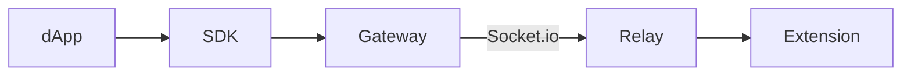
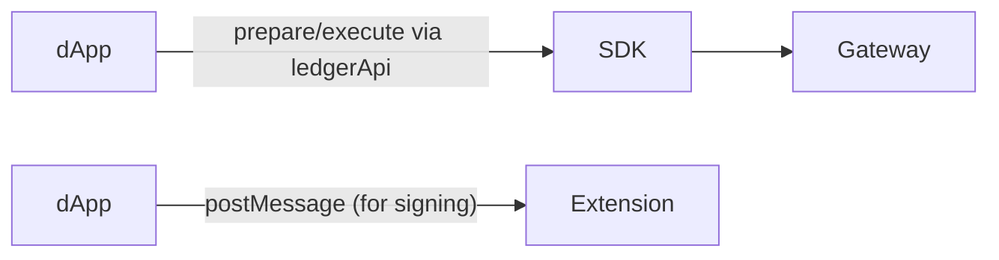
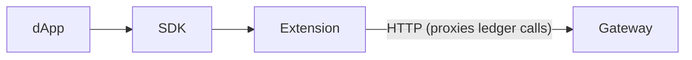
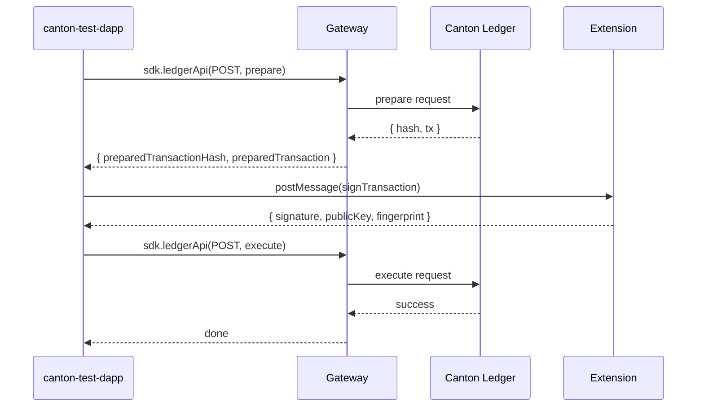

# Extension-Signed Transactions via Wallet Gateway

## Context

The Ginkgo browser extension manages keys locally (IndexedDB, AES-encrypted). The Wallet Gateway has ledger API access (prepare/execute transactions). Currently these are disconnected:

- **Gateway mode**: ledgerApi/prepareExecute work, but uses Gateway's own keys (`ledger-api-user`)
- **Extension mode**: has the user's private key, but can't do ledger queries or submit transactions

**Goal**: dApp connects to extension for signing, submits transactions via Gateway — the extension's private key signs what the Gateway prepares.

## Three Approaches Evaluated

### Approach A: Signing Relay (production)



Gateway delegates signing to extension via a relay service. Already designed in `dapp-connectivity-plan.md`. Best for production but requires extra infrastructure (relay service).

### Approach B: dApp-Orchestrated Hybrid (prototyping — recommended to start)



dApp connects to Gateway for ledger access, talks to extension directly for signing. Orchestrates the prepare → sign → execute flow itself.

### Approach C: Extension as Gateway Proxy



Extension implements `ledgerApi`/`prepareExecute` by proxying to Gateway internally. Most complex.

## Recommended: Start with Approach B, then build Approach A

Approach B is simplest to prototype (2 small changes). Once validated, Approach A (signing relay) provides the production-grade architecture.

---

## Approach B Implementation Plan

### How It Works

```text
1. dApp connects to Gateway via SDK Discovery ("Remote")
   → Gets sdk.ledgerApi() access + session (userId: "ledger-api-user")

2. dApp detects extension via postMessage (already implemented)
   → Can call signTransaction on extension

3. Hybrid transaction flow:
   a. sdk.ledgerApi(POST, /v2/interactive-submission/prepare, body)
      → Returns { preparedTransactionHash, preparedTransaction }
   b. postMessage → extension signTransaction({ transactionHash })
      → Extension signs with private key, returns { signature, publicKey }
   c. sdk.ledgerApi(POST, /v2/interactive-submission/execute, body)
      → Submits with signature + party info
```

### Prerequisites

The extension's party (`dapp-user::1220...`) must be onboarded via dapp-core so that:

- `ledger-api-user` has `CanActAs` rights for that party
- The party is registered in the Canton participant

### Change 1: Add `signTransaction` to Extension

**File**: `ginkgo/entrypoints/background/handlers/dapp-api.handler.ts`

Add handler that signs a transaction hash with the cached private key:

```typescript
async function handleSignTransaction(params: unknown): Promise<{
  signature: string;
  publicKey: string;
  fingerprint: string;
}> {
  const { transactionHash } = (params || {}) as { transactionHash?: string };
  if (!transactionHash) throw new Error('Missing "transactionHash" parameter');

  const { partyId, isReady } = await getWalletState();
  if (!isReady || !partyId) throw new Error('Wallet must be unlocked and onboarded');

  const privateKey = getCachedPrivateKey();
  if (!privateKey) throw new Error('Private key not available — unlock wallet');

  const { signTransactionHash, derivePublicKey } = await import(
    '@canton-network/core-signing-lib'
  );

  const signature = signTransactionHash(transactionHash, privateKey);
  const publicKey = derivePublicKey(privateKey);
  const fingerprint = partyId.split('::')[1];

  return { signature, publicKey, fingerprint };
}
```

Register in methods map:

```typescript
signTransaction: handleSignTransaction,  // replace notImplemented stub
```

**Input**: `{ transactionHash: string }` — hex-encoded hash from Canton prepare
**Output**: `{ signature, publicKey, fingerprint }` — Ed25519 signature + key info

### Change 2: Add Hybrid Flow to Test dApp

**File**: `canton-test-dapp/src/App.tsx`

Add a new "Hybrid Submit" section that orchestrates prepare → sign → execute:

```typescript
async function handleHybridPing() {
  if (!primaryParty) return;

  // Step 1: Prepare via Gateway's ledgerApi proxy
  const prepareBody = JSON.stringify({
    commands: createPingCommand(ledgerApiVersion, primaryParty).commands,
    commandId: `ping-${Date.now()}`,
    userId: statusEvent?.session?.userId,
    actAs: [primaryParty],
    readAs: [],
    synchronizerId: '', // Gateway fills this
    verboseHashing: false,
    packageIdSelectionPreference: [],
  });

  const prepareResult = await sdk.ledgerApi({
    requestMethod: 'POST',
    resource: '/v2/interactive-submission/prepare',
    body: prepareBody,
  });
  const { preparedTransactionHash, preparedTransaction } = JSON.parse(
    prepareResult.response
  );

  // Step 2: Sign via extension (postMessage)
  const { signature, publicKey, fingerprint } = await rpcRequest<{
    signature: string;
    publicKey: string;
    fingerprint: string;
  }>('signTransaction', { transactionHash: preparedTransactionHash });

  // Step 3: Execute via Gateway's ledgerApi proxy
  const executeBody = JSON.stringify({
    userId: statusEvent?.session?.userId,
    preparedTransaction,
    hashingSchemeVersion: 'HASHING_SCHEME_VERSION_V2',
    submissionId: `ping-${Date.now()}`,
    deduplicationPeriod: { Empty: {} },
    partySignatures: {
      signatures: [{
        party: primaryParty,
        signatures: [{
          signature,
          signedBy: fingerprint,
          format: 'SIGNATURE_FORMAT_CONCAT',
          signingAlgorithmSpec: 'SIGNING_ALGORITHM_SPEC_ED25519',
        }],
      }],
    },
  });

  await sdk.ledgerApi({
    requestMethod: 'POST',
    resource: '/v2/interactive-submission/execute',
    body: executeBody,
  });
}
```

UI: Add "Hybrid Ping" button in Ledger Submit tab that only enables when both Gateway and extension are detected.

### Data Flow Diagram



### Signature Format Details

The Canton ledger `/v2/interactive-submission/execute` expects:

| Field | Value | Source |
|-------|-------|--------|
| `signature` | Base64 Ed25519 signature | Extension `signTransactionHash()` |
| `signedBy` | Fingerprint hex string | Extension `partyId.split('::')[1]` |
| `format` | `SIGNATURE_FORMAT_CONCAT` | Constant |
| `signingAlgorithmSpec` | `SIGNING_ALGORITHM_SPEC_ED25519` | Constant |
| `party` | Full partyId | Extension's `partyId` |

### Auth Requirement

The prepare/execute calls use `userId` from the Gateway session (`ledger-api-user`). This user must have `CanActAs` rights for the extension's party. This is set up by dapp-core during onboarding via `grantAdminRights()`.

**If rights are missing**, the prepare call will fail with a permission error. Fix: ensure dapp-core's admin user has been granted rights for the extension's party.

### Files to Change

| File | Change |
|------|--------|
| `ginkgo/entrypoints/background/handlers/dapp-api.handler.ts` | Add `handleSignTransaction`, register in methods map |
| `canton-test-dapp/src/App.tsx` | Add `handleHybridPing` function, add "Hybrid Ping" button in Ledger Submit tab |

### Verification

1. Start dapp-core + Wallet Gateway + Canton network
2. Load Ginkgo extension (unlocked, party onboarded)
3. Open canton-test-dapp
4. Connect via Discovery → select "Wallet Gateway (localhost, dev)"
5. Verify: status shows `kernel: dapp-gateway`, `isConnected: true`, accounts loaded
6. Verify: extension detected (green dot)
7. Click "Hybrid Ping" in Ledger Submit tab
8. Verify in log:
   - `[Hybrid] Preparing transaction...` → prepare succeeds with txHash
   - `[Hybrid] Signing via extension...` → extension signs, returns signature
   - `[Hybrid] Executing transaction...` → execute succeeds
9. Check Canton participant for the Ping contract creation

### Known Limitations (Approach B)

- **Dual connection**: dApp must maintain both SDK (Gateway) and postMessage (extension) — not a single unified API
- **No approval popup**: Extension signs immediately without user confirmation (for prototyping; production should show approval UI)
- **Auth dependency**: Requires dapp-core to have granted `CanActAs` for extension's party to `ledger-api-user`
- **No SDK events**: Transaction completion not reported via `txChanged` SDK event (would need manual polling)

### Migration to Approach A (Production)

Once Approach B validates the concept, migrate to the Signing Relay:

1. Build relay service (`ginkgo/tools/signing-relay/`)
2. Extension connects to relay via Socket.io (registers keys)
3. Gateway configured with `BLOCKDAEMON_API_URL=http://localhost:4100`
4. dApp uses ONLY SDK — connects to Gateway via Discovery
5. Gateway delegates signing to extension through relay
6. Full SDK event support, single connection, clean UX
