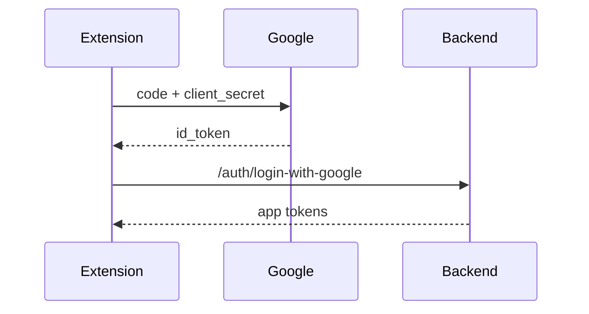
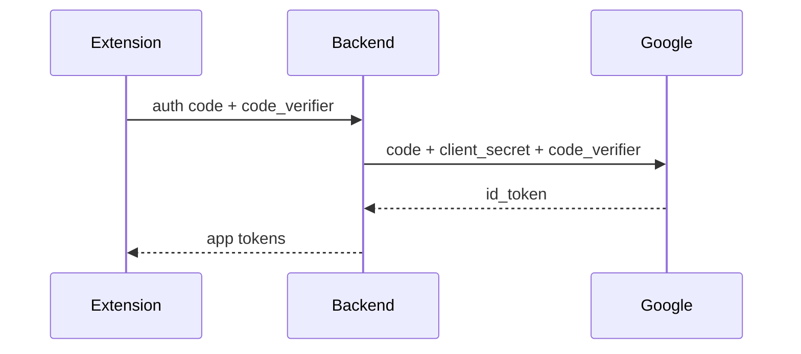

# Security Audit Report — Ginkgo Extension

**Date:** 2026-02-23
**Updated:** 2026-03-23
**Scope:** Full codebase review of `ginkgo/`
**Focus areas:** Cross-account key leaking, unauthorized submission, authentication, session management, input validation, cryptography

---

## Summary

| Severity | Total | Fixed | Open |
|----------|-------|-------|------|
| Critical | 4     | 4     | 0    |
| High     | 4     | 1     | 3    |
| Medium   | 7     | 1     | 6    |
| Low      | 4     | 0     | 4    |

The extension uses strong encryption at rest (AES-GCM + PBKDF2) and avoids common web vulnerabilities (no XSS vectors, no `eval`, no dynamic script loading). All four critical vulnerabilities have been fixed — the in-memory key cache is now cleared on logout/network switch, signing handlers validate sender identity and key fingerprints, `.env` is gitignored, and the OAuth flow includes a `state` parameter.

---

## Critical Vulnerabilities

### C1. Cross-Account Key Leaking — Cached Private Key Not Cleared on Logout — FIXED

**Files:**

- `entrypoints/background/handlers/auth.handler.ts` (lines 180–189)
- `entrypoints/background/handlers/session.handler.ts` (lines 9–18)

**Description:**
After a user unlocks the wallet, the decrypted private key is cached in a module-level variable `_cachedPrivateKey` inside `session.handler.ts`. The `handleLock()` function correctly clears this cache, but `handleLogout()` does not.

```typescript
// session.handler.ts
let _cachedPrivateKey: string | null = null;

// handleLock — CORRECT
export async function handleLock() {
  _cachedPrivateKey = null; // cleared
  await sessionStore.set('unlocked', false);
  chrome.alarms.clear(ALARM_NAME);
  return ok({ unlocked: false });
}

// auth.handler.ts — handleLogout — MISSING KEY CLEAR
export async function handleLogout() {
  await sessionStore.clear();
  await localStore.set('user', null);
  setUserScope(null);
  // _cachedPrivateKey is NOT cleared
  // auto-lock alarm is NOT cleared
  return ok(undefined);
}
```

**Attack scenario:**

1. User A logs in, unlocks wallet. `_cachedPrivateKey` holds User A's key.
2. User A clicks Sign Out. Session/storage cleared, but `_cachedPrivateKey` persists.
3. User B logs in on the same extension.
4. Any operation calling `getCachedPrivateKey()` returns User A's key to User B.
5. User B can sign transactions using User A's private key.

**The same bug exists in `handleSwitchNetwork()`** (`entrypoints/background/handlers/network.handler.ts`, lines 16–43) — session is cleared but the cached key persists.

**Fix:**

```typescript
// auth.handler.ts — handleLogout
import { setCachedPrivateKey } from './session.handler';

export async function handleLogout() {
  setCachedPrivateKey(null);          // ADD
  chrome.alarms.clear('auto-lock');   // ADD
  await sessionStore.clear();
  await localStore.set('user', null);
  setUserScope(null);
  return ok(undefined);
}

// network.handler.ts — handleSwitchNetwork
import { setCachedPrivateKey } from './session.handler';

export async function handleSwitchNetwork(network) {
  setCachedPrivateKey(null);          // ADD
  // ... rest of existing code
}
```

---

### C2. Missing senderPartyId Validation in Signing Handlers — FIXED

**File:** `entrypoints/background/handlers/signing.handler.ts`

**Description:**
The signing handler accepted `preparedData` (including `senderPartyId`) from the popup and signed it without verifying that the sender matches the currently authenticated user.

**Fix applied:** All signing handlers now call `verifyCurrentParty()` (line 21) which checks the session's `partyId` against the prepared data's `senderPartyId`. Additionally, a unified `signAndVerify()` helper (line 74) decrypts the key, derives the public key, verifies the fingerprint (see H3), and signs — applied to all 5 handlers: `handleSignAndSubmitTransferPreapproval`, `handleSignAndSubmitTransferTokenStandard`, `handleSignAndSubmitApprove`, `handleSignAndSubmitReject`, `handleSignAndSubmitWithdraw`.

---

### C3. Exposed Google OAuth Client Secret — FIXED (partial)

**File:** `.env` (line 3)

**Description:**
The Google OAuth client secret (`VITE_GOOGLE_CLIENT_SECRET`) is hardcoded in the `.env` file. If committed to version control, any attacker with repo access can impersonate the wallet application in OAuth flows and forge authentication tokens.

**Fix:**

- Remove `.env` from version control (add to `.gitignore`).
- Rotate the Google client secret immediately.
- Use environment-specific secret injection for builds.

**Additional concern — client secret visible in built JavaScript:**

Because `VITE_`-prefixed variables are embedded in the Vite build output, the client secret is extractable from the production bundle even after removing `.env` from git. Encryption or obfuscation does not help — the decryption key would also be in the bundle. The real fix is to remove the secret from the client entirely. Three options, in order of preference:

**Option A — Proxy token exchange through the backend (recommended):**
Instead of exchanging the Google authorization code in the extension, send the code to the backend and let it perform the token exchange server-side. The backend already holds the client secret for `/auth/login-with-google`. A new endpoint (e.g. `/auth/google-callback`) would accept the authorization code + PKCE code verifier, call Google's token endpoint server-side, and return the app tokens. This keeps the `client_secret` entirely off the client.

Current flow:



Secure flow:



**Option B — Use Chrome Identity API:**
Replace `chrome.identity.launchWebAuthFlow()` with `chrome.identity.getAuthToken()`. This uses Chrome's built-in OAuth integration tied to the extension ID and requires no client secret. Trade-off: requires the user to be signed into Chrome.

**Option C — Switch OAuth client type:**
Create a new OAuth client in Google Cloud Console as **"Chrome Extension"** type instead of "Web Application". This type authenticates via the extension ID and does not require a client secret — only `client_id` + PKCE.

---

### C4. No OAuth `state` Parameter (CSRF on Auth Flow) — FIXED

**File:** `entrypoints/background/handlers/auth.handler.ts` (lines 45–59)

**Description:**
While PKCE is implemented correctly, the `state` parameter is missing from the Google OAuth authorization request. The `state` parameter prevents CSRF attacks by binding the authorization response to the original request.

```typescript
const authUrl = new URL('https://accounts.google.com/o/oauth2/v2/auth');
authUrl.searchParams.set('client_id', GOOGLE_CLIENT_ID);
authUrl.searchParams.set('redirect_uri', redirectUri);
authUrl.searchParams.set('response_type', 'code');
authUrl.searchParams.set('scope', 'openid email profile');
authUrl.searchParams.set('code_challenge', codeChallenge);
authUrl.searchParams.set('code_challenge_method', 'S256');
// MISSING: authUrl.searchParams.set('state', randomState);
```

**Fix:**

```typescript
const state = crypto.randomUUID();
authUrl.searchParams.set('state', state);

// After receiving responseUrl:
const returnedState = new URL(responseUrl).searchParams.get('state');
if (returnedState !== state) {
  return err('OAuth state mismatch — possible CSRF attack');
}
```

---

## High Vulnerabilities

### H1. Cached Key Enables Password-less Signing

**Files:**

- `entrypoints/background/handlers/keystore.handler.ts` — `handleRegisterTransferPreapproval()`, faucet
- `entrypoints/background/handlers/api.handler.ts` — `handleRequestFaucet()`
- `entrypoints/background/handlers/session.handler.ts` — `getCachedPrivateKey()`

**Description:**
After initial unlock, `getCachedPrivateKey()` returns the decrypted private key without requiring the password again. Transfer preapproval and faucet operations use this cached key directly. If the user steps away from an unlocked wallet, an attacker with physical access could trigger these operations without knowing the password until the auto-lock timer fires (default: 15 minutes).

**Current mitigations (partial):**

- All **transfer and offer signing handlers** (`signing.handler.ts`) require the password — they call `decryptKey(password)`, not `getCachedPrivateKey()`
- **CIP-0103 dApp operations** (signMessage, signTransaction, prepareExecute) require explicit user approval via popup
- Only **preapproval registration** and **faucet** use the cached key without password re-entry
- The faucet UI does collect a password, but `handleRequestFaucet()` uses the cached key first and only falls back to password decryption

**Recommendation:**

- Remove cached key fallback from faucet handler — always use password-decrypted key
- Reduce the default auto-lock timeout
- Consider requiring password for preapproval registration as well

---

### H2. No Re-Verification of Transaction Details Between Confirm and Submit

**Files:**

- `entrypoints/popup/pages/dashboard/Transfer.tsx` (lines 48–78)
- `entrypoints/background/handlers/signing.handler.ts` (lines 20–46)

**Description:**
The `preparedData` object (containing recipient, amount, transaction hash) is stored in React state after the prepare step and sent as-is to the signing handler. There is no verification that the transaction details the user confirmed match the ones being signed. If popup code is compromised, `preparedData` could be swapped between user confirmation and submission.

**Recommendation:**

- Re-fetch or re-validate `preparedData` from the backend in the signing handler.
- Or compute a client-side hash of the displayed transaction details and verify it matches before signing.

---

### H3. No Fingerprint Verification Against Current Key — FIXED

**File:** `entrypoints/background/handlers/signing.handler.ts`

**Description:**
The signing handler never verified that the fingerprint of the private key being used matches the fingerprint embedded in the `senderPartyId` (format: `hint::fingerprint`). If a wrong key was cached (see C1), the backend would reject the signature with a cryptic "0 valid signatures (1 invalid)" error.

**Fix applied:** `verifyKeyFingerprint()` (line 36) computes the Canton fingerprint (`hex(0x1220 || SHA256(int32_be(12) || pubkey))`) from the derived public key and compares it against the partyId's fingerprint. This is called by the unified `signAndVerify()` helper used by all signing handlers. Throws a descriptive error on mismatch.

---

### H4. Refresh Token Replay — No Rotation or Invalidation

**File:** `entrypoints/background/api-client.ts` (lines 35–51)

**Description:**
The refresh token is stored in `chrome.storage.session` and sent to the server on 401 responses. There is no token rotation — the same refresh token can be used indefinitely to generate new access tokens. If an attacker captures a refresh token, they gain persistent access even after password changes.

```typescript
const { data } = await axios.post(`${currentBaseUrl}/auth/refresh-token`, {
  refreshToken,
});
const newToken = data?.data?.token;
const newRefresh = data?.data?.refreshToken;
await sessionStore.setMany({
  authToken: newToken,
  refreshToken: newRefresh ?? refreshToken, // Falls back to OLD token if none returned
});
```

**Recommendation:**

- Implement refresh token rotation: each refresh returns a new token, invalidating the old one.
- Backend should reject reused refresh tokens.

---

## Medium Vulnerabilities

### M1. Insufficient Numeric Validation on Amounts

**Files:**

- `entrypoints/popup/pages/dashboard/TokenDetail.tsx` (lines 152–183)
- `entrypoints/popup/pages/dashboard/Transfer.tsx` (lines 20–78)

**Description:**
Transaction amounts are passed as raw strings without validating they are finite positive numbers. The UI `disabled` check uses `Number()` which can return `NaN` or `Infinity`, and the amount is sent as a string to the backend.

```typescript
// TokenDetail.tsx — faucet
disabled={faucetLoading || !faucetAmount || Number(faucetAmount) <= 0 || Number(faucetAmount) > 10000}
// "Infinity", "1e308", "NaN" can bypass this check in edge cases

// Transfer.tsx — transfer
disabled={!recipient || !amount || isPreparing}
// No numeric validation at all — "abc" passes this check
```

**Fix:**

```typescript
const isValidAmount = (val: string): boolean => {
  const num = parseFloat(val);
  return Number.isFinite(num) && num > 0;
};
```

---

### M2. Party ID Format Never Validated

**File:** `entrypoints/popup/pages/dashboard/Transfer.tsx` (lines 20, 59)

**Description:**
Recipient party IDs are accepted as arbitrary strings with no format check before submission. Expected format: `hint::fingerprint` where fingerprint is a hex string.

**Fix:**

```typescript
const PARTY_ID_REGEX = /^[^:]+::[a-fA-F0-9]+$/;
const isValidPartyId = (id: string): boolean => PARTY_ID_REGEX.test(id.trim());
```

---

### M3. `atob()` / `JSON.parse()` Without Error Handling

**Files:**

- `entrypoints/background/handlers/keystore.handler.ts` (lines 268–289)
- `entrypoints/background/encryption/webcrypto.ts` (lines 17, 88)
- `lib/utils.ts` (lines 19–31)

**Description:**
Multiple `atob()` calls and `JSON.parse()` on stored data lack try-catch. Corrupted storage or malformed imported keys will crash the handler instead of returning a clean error.

```typescript
// keystore.handler.ts — no try-catch
function base64ToHex(b64: string): string {
  const raw = atob(b64); // throws on invalid base64
  // ...
}

// webcrypto.ts — no try-catch
const { salt, iv } = JSON.parse(bundle.hashedKey); // throws on malformed JSON
```

Additionally, `parseInt(hex, 16)` in `hexToBase64()` silently returns `NaN` for invalid hex, which propagates as `String.fromCharCode(0)` — producing a silently wrong result.

**Fix:** Wrap all `atob()` and `JSON.parse()` calls in try-catch blocks. Validate hex strings before parsing.

---

### M4. Faucet Operation Lacks Confirmation UI — PARTIALLY FIXED

**File:** `entrypoints/popup/pages/dashboard/TokenDetail.tsx` (faucet section, lines 143–191)

**Description:**
Unlike transfers (which show a two-step confirm screen), the faucet executes in a single step.

**Current state:** The faucet UI now requires the user to enter their password and the amount before requesting. However, it does not show a separate confirmation screen with transaction details — it goes directly from input to prepare-sign-submit in one handler call. This is acceptable for a low-risk DevNet-only operation, but a confirmation step would be more consistent with the transfer flow.

---

### M5. Passwords Passed Through Chrome Message Protocol

**Files:**

- `entrypoints/background/handlers/signing.handler.ts` (lines 21–26)
- `entrypoints/background/handlers/keystore.handler.ts` (line 71)
- `entrypoints/background/handlers/api.handler.ts` (line 209)

**Description:**
Passwords are sent in plaintext from the popup to the background via `chrome.runtime.sendMessage()`. While contained within the extension context, any future logging or debugging changes could expose passwords in console output.

---

### M6. No API Response Schema Validation

**File:** `entrypoints/background/handlers/auth.handler.ts` (lines 88–98)

**Description:**
API responses (login, token exchange, etc.) are destructured without validating the expected structure. A malformed backend response could set `undefined` values in auth state.

```typescript
const { token, refreshToken, user } = loginData.data;
// If loginData.data is undefined, all three are undefined — no error thrown
```

**Recommendation:** Add Zod schema validation for all API response types.

---

### M7. `localhost` in Host Permissions

**File:** Built manifest — `host_permissions` includes `http://localhost/*`

**Description:**
This matches any local service on the machine, expanding the attack surface. In production builds, localhost should not be needed.

**Fix:** Conditionally include `http://localhost/*` only in development builds.

---

## Low Vulnerabilities

### L1. Auto-Lock Default of 15 Minutes

**File:** `lib/constants.ts` (line 40)

A 15-minute auto-lock window is generous for a wallet holding private keys. Consider defaulting to 5 minutes.

### L2. Salt and IV Stored Alongside Ciphertext

**File:** `entrypoints/background/encryption/webcrypto.ts` (lines 70–73)

The salt and IV are stored as plaintext JSON alongside the encrypted key. While IVs are typically public, there is no HMAC or integrity check over the ciphertext.

### L3. Debug Console Logging in Handlers

**Files:** `auth.handler.ts` (line 39), `keystore.handler.ts` (lines 115–154)

OAuth redirect URIs, party IDs, and transaction flow data are logged to the console. While no private keys are logged, this data could aid an attacker with DevTools access.

### L4. Hardcoded RSA Key Pins Extension ID

**File:** `wxt.config.ts` (lines 11–14)

The RSA public key is hardcoded to pin the extension ID to `nedmfnmjfdneopknpheohpcngdaeipec`. If the corresponding private key is leaked, an attacker can publish a malicious extension with the same ID.

---

## Positive Findings

The following areas were reviewed and found to be properly implemented:

- **Encryption at rest:** AES-GCM with PBKDF2 (100,000 iterations, random 16-byte salt, 12-byte IV) via Web Crypto API
- **Password hashing:** bcrypt with configurable salt rounds
- **No XSS vectors:** No `dangerouslySetInnerHTML`, `innerHTML`, `eval()`, `Function()`, or dynamic script loading
- **No private keys logged:** Console logging does not include key material
- **Per-user key isolation in storage:** Keys scoped by `{network}:{userId}:keystore` in `chrome.storage.local`
- **Type-safe message routing:** TypeScript discriminated unions with exhaustive switch, no fall-through
- **Settings page key cleanup:** Exported private key auto-clears from React state after 30 seconds, plus cleanup on unmount
- **PKCE in OAuth:** Code challenge and verifier properly generated
- **CIP-0103 content script isolation:** Content script bridges `window.postMessage` to `chrome.runtime.sendMessage` but validates message source (`event.source !== window` guard) and only forwards recognized `SpliceMessage` types. dApp API requests are handled in a separate listener from popup messages, preventing cross-contamination. User approval popup required for connect, sign, and execute operations.

---

## Recommended Fix Priority

| Priority | ID | Action | Status |
| -------- | -- | ------ | ------ |
| Immediate | C1 | Clear `_cachedPrivateKey` in `handleLogout()` and `handleSwitchNetwork()` | FIXED |
| Immediate | C2 | Validate `senderPartyId` against current session in all signing handlers | FIXED — `verifyCurrentParty()` in all 5 signing handlers |
| Immediate | C3 | Remove `.env` from version control, rotate Google client secret | FIXED (`.gitignore` added, `.env` untracked; client secret still in bundle — see C3 options) |
| High | C4 | Add OAuth `state` parameter generation and validation | FIXED |
| High | H3 | Add fingerprint check before signing | FIXED — `verifyKeyFingerprint()` via `signAndVerify()` in all signing handlers |
| High | H4 | Implement refresh token rotation on backend | Open (backend-side) |
| Medium | M1 | Validate amounts with `Number.isFinite()` before submission | Open (Transfer.tsx lacks numeric validation) |
| Medium | M2 | Validate party ID format with regex before API calls | Open |
| Medium | M3 | Wrap `atob()` / `JSON.parse()` in try-catch blocks | Open |
| Medium | M4 | Faucet confirmation UI | Partially fixed (password required, but no 2-step confirm) |
| Low | H1 | Require password re-entry for high-value operations | Open (faucet + preapproval use cached key) |
| Low | M7 | Remove `localhost` from host permissions in production builds | Open |
